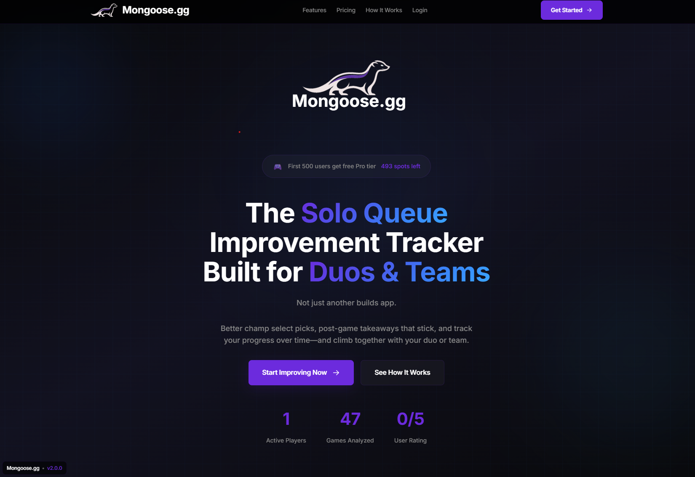

# League of Legends improvement tracker

> "The only LoL improvement tracker built for duos and teams, powered by AI coaching that turns your stats into actionable goals you can actually achieve."

This project helps players (solo, duo, and full teams) understand their performance with rich match analytics, timeline-derived metrics, and AI goal recommendations.



## 1st time install

#### Git
##### Mac:
use homebrew if on mac: 
```
/bin/bash -c "$(curl -fsSL https://raw.githubusercontent.com/Homebrew/install/HEAD/install.sh)"
```
```
brew install git
```

##### Windows:
Download git installer

##### Linux Fedora:
```
sudo dnf install git-all
```

##### Set git user (from terminal)
```
git config --global user.name anon

git config --global user.email anon.anonsen@pm.me
```
#### Node.js
Download and install node js installer https://nodejs.org/en/download

#### Install Visual Studio code
https://code.visualstudio.com/download

##### VS Code Extensions
Git Graph

Markdown Preview

Vue

Github actions

C# Dev Kit

## In Visual Studio:
Git clone https://github.com/mongoose84/AgileAstronaut.com.git

The file structure contains a server and a client part.

## .NET SDK
##### Windows:
Download .NET 9.0 SDK installer

##### Linux Fedora:
```
sudo dnf install dotnet-sdk-9.0
```

#### Client (standalone app)
**Clientis a completely separate Vue 3 + Vite application, independent of the legacy client.**

- Location: `client/` 
- Style: Start with the Vercel developer aesthetic (dark, sharp, neon-tinged) but keep theme tokens configurable for future restyles.
- Rollout: Develop locally until the solo dashboard is ready, then ship.
- The app will have its own `package.json`, `node_modules`, and complete build setup.

##### Install and run Client
from root
```
cd client
```
```
npm install
```
```
npm run dev
```
```
npm run test:unit
```

#### Server part
from root
```
cd server
```

##### Riot API Key
Get your API key from the [Riot Developer Portal](https://developer.riotgames.com/).

**.NET user-secrets (recommended for local development)**
```bash
# from server/ directory
dotnet user-secrets init  # only needed once
dotnet user-secrets set "Riot:ApiKey" "RGAPI-xxxxxxxx-xxxx-xxxx-xxxx-xxxxxxxxxxxx"
```

##### Database connection string (local)
Set via user-secrets:
```bash
# user-secrets (from server/)
dotnet user-secrets set "ConnectionStrings:DatabaseV2" "Server=...;Password=...;"
```

##### Email Encryption Key
Emails are encrypted at rest in the database. Generate a key and set it via user-secrets:
```bash
# Generate a new key (run once, save the output securely!)
openssl rand -base64 32

# Set via user-secrets (from server/)
dotnet user-secrets set "Security:EmailEncryptionKey" "your-generated-key-here"
```

**⚠️ Important:** Store this key securely! If lost, encrypted emails cannot be recovered. If leaked, emails can be decrypted.

##### Build and run

build and run the application
```
dotnet build
dotnet run

dotnet publish -c Release -r win-x86 --self-contained true 
```
This will create all the files needed in the folder /bin/Release/publish

##### Run server tests
```
cd root
dotnet test lol.sln
```